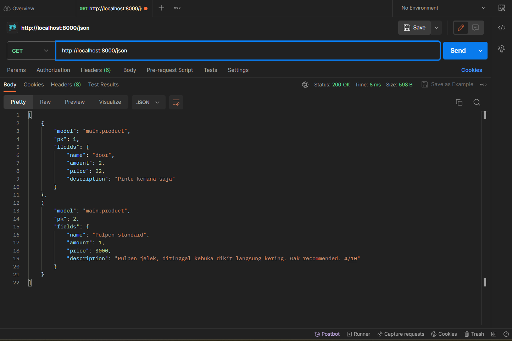

# TUGAS 2

Tautan app Adaptable: 
https://malaymart.adaptable.app

1. Jelaskan bagaimana cara kamu mengimplementasikan checklist di atas secara step-by-step?

    Tick pertama:
    
    - Membuat direktori baru dengan nama `malaymart`.
    - Buka command prompt dengan dalam direktori yang telah dibuat.
    - Buat virtual environment dengan cara menjalankan perintah 
        `python -m venv env`
    - Aktifkan virtual environment dengan menjalankan perintah 
        `env\Scripts\activate.bat`
    - Membuat berkas `requirements.txt` dan isi dengan beberapa dependencies yang tersedia
    - Pasang depencies dengan perintah berikut
        `pip install -r requirements.txt`
    - Buat proyek Django dengan perintah 
        `django-admin startproject malaymart .`
    - Tambahkan * pada ALLOWED_HOSTS di settings.py untuk mengizinkan akses dari semua host.
    - Nonaktifkan server dengan menekan Ctrl+C dan nonaktifkan virtual environment dengan memasukkan perintah `deactivate`.
    - Buat repositori baru bernama `malaymart`.
    - Inisiasi direktori lokal `malaymart` sebagai repostori Git dengan membuat Branch utama baru menggunakan perintah `git branch -M main`, kemudian gunakan perintah `git remote add origin <URL_repo>` untuk menghubungkan direktori lokal dengan repositori Git.
    - Tambah berkas `.gitignore` di direktori dan isi dengan teks yang tersedia. Berkas ini tidak akan dimasukkan ke dalam versi kontrol Git.
    - Lakukan add, commit, dan push untuk menyimpan ke dari direktori lokal ke repositori Git

    Tick kedua:
    - Aktifkan virtual environment lagi menggunakan perintah `env\Scripts\activate.bat` dalam direktori proyek yang sudah dibuat
    - Buat aplikasi baru bernama `main` dengan perintah `python manage.py startapp main`
    - Tambahkan 'main' ke dalam variabel `INSTALLED_APPS` yang terdapat di berkas `settings.py`

    Tick ketiga:
    - Buka berkas `urls.py` yang terdapat dalam direktori `malaymart`
    - Impor fungsi `include` dari `django.urls`
    - Tambahkan rute URL untuk mengarahkan ke tampilan `main` di dalam variabel `urlpatterns`
    - Jalankan proyek Django dengan perintah `python manage.py runserver`
    
    Tick keempat:
    - Buka berkas `models.py` pada direktori app `main`
    - Isi berkas tersebut dengan kode yang tersedia
    - Tambahkan atribut-atribut wajib seperti `main`, `amount`, dan `description` dalam berkas tersebut.
    - Migrasikan model dengan perintah `python manage.py makemigrations`
    - Jalankan perintah `python manage.py migrate` untuk menerapkan migrasi ke dalam data lokal
    
    Tick kelima:
    - Tambahkan kode `from django.shortcuts import render` pada berkas `views.py` dalam aplikasi `main` untuk mengimpor fungsi render. Fungsi ini digunakan untuk me-render tampilan HTML
    - Tambahkan pula fungsi `show_main` yang tersedia
    
    Tick keenam:
    
    - Buat berkas `urls.py` dalam direktori `main`
    - Isi berkas tersebut dengan kode yang tersedia
    
    Tick ketujuh:
    - Login kedalam `Adaptable.io` 
    - Tekan tombol `New App` lalu pilih `connect an existing repository`
    - Hubungkan Adaptable dengan Github dan pilih `All Repositories` saat instalasi.
    - Pilih repositori `malaymart` sebagai basis aplikasi yang akan di deploy. Kemudian pilih branch main sebagai deployment branch.
    - Pilih `python app template` kemudian pilih `PostgreSQL`.
    - Sesuaikan versi Python dengan spesifikasinya. Kemudian pada bagian `Start Command` masukkan perintah `python manage.py migrate && gunicorn malaymart.wsgi`
    - Masukkan nama aplikasi
    - Centang bagian `HTTP Listener on PORT` dan klik `Deploy`
    
2. Buatlah bagan yang berisi request client ke web aplikasi berbasis Django beserta responnya dan jelaskan pada bagan tersebut kaitan antara urls.py, views.py, models.py, dan berkas html.

    

3. Jelaskan mengapa kita menggunakan virtual environment! Apakah kita tetap dapat membuat aplikasi web berbasis Django tanpa menggunakan virtual environment? 
    Virtual environment merupakan sebuah tool yang membantu untuk memisahkan dependensi yang diperlukan oleh proyek berbeda dengan membuat virtual environment python yang terisolasi. Bisa saja, namun sangat disarankan untuk menggunakan virtual environment dikarenakan akan memungkinkan kita untuk mengisolasi dependensi proyek dan mencegah konflik antara dependensi proyek yang berbeda

4. Jelaskan apakah itu MVC, MVT, MVVM dan perbedaan dari ketiganya!
    MVC:
    - Model: Berisi representasi data dan logika bisnis aplikasi. Model bertugas untuk mendapatkan dan memanipulasi data, berkomunikasi dengan controller, berinteraksi dengan database, dll.
    - View: Tampilan yang digunakan untuk menampilkan data kepada pengguna. Tidak memiliki logika bisnis dan hanya bertugas menampilkan informasi ynag diberikan model.
    - Controller: Bertindak sebagai perantara antara mode dan view. Mengatur aliran data antara keduanya serta menangani permintaan pengguna.

    MVT:
    - Model: Sama seperti dalam MVC, bagian ini berisi logika bisnis dan representasi data.
    - View: Komponen yang menangani logika presentasi dan juga mengontrol bagaimana data yang dikelola oleh model akan ditampilkan kepada pengguna.
    - Template: Digunakan untuk merancang tampilan yang akhirnya akan diisi dengan data dari model melalui view.

    MVVM:
    - Model: Model yang digunakan mirip dengan MVC dimana model tersebut terdiri dari data dasar yang digunakan untuk menjalankan perangkat lunak.
    - View: Digunakan sebagai antarmuka grafis antara pengguna dan pola desain, serta menampilkan output dari data yang telah diproses.
    - ViewModel: Merupakan abstraksi dari View, dan sebagai penyedia pembungkus data model yang ditautkan. Terdiri dari model yang diubah menjadi View.

    Perbedaan:
    Perbedaan utama antara ketiga pendekatan ini adalah cara ketiganya mengatur logika bisnis, aliran data, dan interaksi antara komponen-komponennya. MVC adalah pendekatan yang lebih tua dan memiliki peran Controller yang lebih khas. MVT adalah varian Django yang menggantikan Controller dengan View dalam MVC. Sedangkan MVVM mengenalkan ViewModel yang bertanggung jawab atas sebagian besar logika presentasi dan interaksi pengguna.


# TUGAS 3

1. Apa perbedaan antara form POST dan form GET dalam Django?
    - `GET` = Biasanya digunakan untuk mengambil sumber daya atau data dari server tanpa mengubah apa pun di yang ada di server. Operasi ini dianggap aman dan idempoten, dimana beberapa permintaan yang identik akan mengasilkan hasil yang sama.
    - `POST` = Metode ini sering digunakan bersisian dengan HTML di frontend untuk membuat objek baru di server. Metode ini juga bisa untuk mengirim data ke server untuk disimpan atau diproses secara lebih lanjut.

2. Apa perbedaan utama antara XML, JSON, dan HTML dalam konteks pengiriman data?
    - `XML` (Extensible Markup Language) = Lebih umum digunakan untuk pertukaran data antar sistem atau aplikasi yang berbeda karena fleksibilitasnya dalam merepresentasikan berbagai jenis data. XML ini didesain untuk membawa data, bukan untuk menampilkannya.
    - `JSON` (JavaScript Object Notation) = Merupakan format yang umum digunakan dalam pengembangan web modern dan sering digunakan dalam pertukaran data antara server dan klien. Sintaks yang ada juga lebih ringkas dan lebih mudah untuk dibaca manusia.
    - `HTML` (Hypertext Markup Language) = Digunakan untuk membangun halaman web dan menampilkan konten secara visual di browser. HTML ini tidak digunakan untuk pertukaran data mentah antar aplikasi seperti XML atau JSON.

    Kesimpulannya, XML digunakan untuk merepresentasikan data struktural dengan struktur yang ketat. JSON digunakan untuk merepresentasikan data dalam bentuk objek dengan sintaks yang lebih ringkas. Sementara HTML digunakan untuk membangun halaman pada web dan menampilkan konten secara visual.

3. Mengapa JSON sering digunakan dalam pertukaran data antara aplikasi web modern?

    Pada zaman aplikasi web modern saat ini, JSON merupakan format yang paling sering digunakan untuk melakukan pertukaran data. Alasannya adalah:
    - Memiliki kecepatan pertukaran data dan hasil pencarian web yang tinggi. Hal ini akan memungkinkan komunikasi yang lebih cepat antar klien dan server.
    - JSON berbasis teks, lebih ringan, dan mempunyai format data yang mudah untuk diuraikan karena tidak memerlukan kode tambahan untuk melakukan penguraian.
    - JSON mempunyai dukungan untuk Cross-Platform sehingga format ini dapat digunakan untuk berbagai platform yang ada saat ini seperti smartphone, dan lain-lain.

4. Jelaskan bagaimana cara kamu mengimplementasikan checklist di atas secara step-by-step?

    Checklist pertama:
    - Membuat berkas baru pada direktori `main` dengan nama `forms.py` dan tambahkan kode yang tersedia kedalam berkas tersebut.
    - Menambahkan beberapa import yang sudah tersedia pada berkas `views.py` yang berada di dalam direktori `main`.
    - Membuat fungsi baru pada `views.py` tersebut dengan nama `create_product` yang menerima parameter `request`. Kemudian masukkan kode yang tersedia kedalam fungsi tersebut.
    - Merubah fungsi `show_main` pada berkas `views.py` dengan kode yang tersedia.
    - Membuka berkas `urls.py` pada direktori `main` dan import fungsi `create_product` yang telah dibuat sebelumnya.
    - Menambahkan path url ke dalam variabel `urlpatterns` pada berkas `urls.py` di `main` untuk mengakses fungsi yang sudah diimport sebelumnya.
    - Membuat berkas HTML baru pada direktori `main/templates` dengan nama `create_product.html`. Isilah berkas tersebut dengan kode yang tersedia.
    - Membuka berkas `main.html`dan tambahkan kode yang telah disediakan ke dalam `` untuk menampilkan data produk dalam bentuk tabel serta menambahkan tombol `Add New Product` yang akan redirect ke halaman form.

    Checklist kedua dan ketiga:
    - Membuka `views.py` yang ada pada direktori `main` dan mengimpor `HttpResponse` dan `Serializer` pada bagian atas.
    - Membuat fungsi `show_xml` dan `show_json` yang menerima parameter `request`. 
    - Mengimpor fungsi `show_xml` dan `show_json` tersebut pada `urls.py` dan tambahkan kedua path nya ke dalam variabel `urlpatterns`.
    - Kembali membuka file `views.py` pada folder `main` dan buat dua fungsi baru bernama `show_xml_by_id` dan `show_json_by_id`. 
    - Buat sebuah variabel dalam kedua fungsi tersebut yang menyimpan hasil query dari data dengan id tertentu pada `Product`.
    - Mengimpor fungsi `show_xml_by_id` dan `show_json_by_id` tersebut pada `urls.py` dan tambahkan kedua path nya ke dalam variabel `urlpatterns`.

4. Screenshot Postman

    - HTML
     

    - XML
     

    - JSON
     
    
    - XML by ID
     

    - JSON by ID
     


# Tugas 4

1. Apa itu Django `UserCreationForm`, dan jelaskan apa kelebihan dan kekurangannya?

    Django `UserCreationForm` adalah sebuah modul build-in yang meng-inherit dari class `ModelForm`. Modul tersebut digunakan untuk membuat user yang baru. `UserCreationForm` memiliki tiga fiels, yaitu: `username`, `password1`, dan `password2`.
    Kelebihan :
    - `UserCreationForm`sudah merupakan modul built-in, sehingga tidak perlu menulis sendiri logika pendaftaran pengguna.
    - `UserCreationForm` dapat dengan mudah disesuaikan dengan kebutuhan kita masing-masing.
    Kekurangan:
    - Logika atau tampilan dari `UserCreationForm` mungkin tidak sesuai dengan keinginan kita, sehingga kita perlu menyesuaikan atau membuat *form* kustom.
    - `UserCreationForm` memiliki ketergantungan pada Django, sehingga akan sulit ketika kita memilih untuk menggunakan *framework* lainnya.

2. Apa perbedaan antara autentikasi dan otorisasi dalam konteks Django, dan mengapa keduanya penting?

    Dalam konteks Django, autentikasi dan otorisasi adalah dua hal yang sangat penting dalam mengelola akses pengguna ke aplikasi web. Perbedaan keduanya adalah:
    - Autentikasi = Proses yang memverifikasi identitas pengguna yang mencoba unutk mengakses aplikasi. Contohnya adalah proses login.
    - Otorisasi = Proses yang terjadi setelah pengguna berhasil melakukan autentikasi. Hal ini mengacu pada kontrol yang diberikan kepada pengguna yang terautentikasi untuk mengakses atau melakukan tindakan tertentu dalam aplikasi.

3. Apa itu cookies dalam konteks aplikasi web, dan bagaimana Django menggunakan cookies untuk mengelola data sesi pengguna?

    *Cookies* adalah salah satu cara untuk menyimpan informasi dalam bentuk teks di sisi klien. Informasi ini dapat digunakan oleh *server web* untuk mengidentifikasi dan melacak sesi pengguna atau menyimpan data yang diperlukan untuk interaksi antar pengguna. Cara Django menggunakan cookies adalah dengan menyimpan data sesi pengguna, menggunakan *session middleware*, mendapatkan kunci unik, mengamankan data, dan mengatur waktu kadaluwarsa sesi.

4. Apakah penggunaan cookies aman secara default dalam pengembangan web, atau apakah ada risiko potensial yang harus diwaspadai?

    Secara umum, penggunaan *cookies* aman secara default dalam pengembangan web jika digunakan dengan benar dan jika diikuti dengan prinsip keamanan yang baik. Namun, ada beberapa potensial resiko yang harus diwaspadai, seperti:
    - Serangan Cross-Site Scripting (XSS).
    - Serangan Cross-Site Request Forgery (CSRF).
    - Enkripsikan data sensitif.
    - Pemantauan cookie, hapus cookie yang tidak lagi diperlukan atau kadaluwarsa.
    - Pemisahan cookie yang digunakan untuk tujuan berbeda.

5. Jelaskan bagaimana cara kamu mengimplementasikan checklist di atas secara step-by-step (bukan hanya sekadar mengikuti tutorial).

    Checklist pertama: 
    
    - Jalankan virtual environment.
    - Buka berkas `views.py` di subdirektori `main`.
    - Tambahkan import `redirect`, `UserCreationForm`, dan `messages`.
    - Tambahkan potongan kode yang tersedia ke dalam fungsi `register`.
    - Buat berkas HTML dengan nama `register.html` pada folder `main/templates` dan isi dengan kode yang tersedia.
    - Buka `urls.py` pada subdirektori `main` dan impor fungsi `register` yang telah dibuat.
    - Tambahkan path url ke dalam `urlpatterns`.
    - Buka `views.py` pada subdirektori `main` dan buat fungsi dengan nama `login_user` yang menerima parameter `request`.
    - Tambahkan import `aunthenticate` dan `login`.
    - Tambahkan kode yang tersedia ke fungsi `login_user` tersebut.
    - Buat berkas HTML dengan nama `login.html` pada folder `main/templates`. Lalu isi berkas tersebut dengan kode yang tersedia.
    - Buka `urls.py` pada subdirektori `main` dan impor fungsi `login_user`.
    - Tambahkan path url ke dalam `urlpatterns` untuk mengakses fungsi yang sudah diimpor tadi.
    - Buka `views.py` pada subdirektori `main` dan buat fungsi dengan nama `logout_user` yang menerima parameter `request`.
    - Tambahkan import `logout`.
    - Tambahkan kode yang tersedia ke dalam fungsi `logout_user` yang telah dibuat.
    - Buka berkas `main.html` yang ada pada folder `main/templates`.
    - Tambahkan potongan kode yang tersedia setelah *hyperlink tag* untuk *Add New Product* pada berkas `main.html`.
    - Buka `urls.py` pada subdirektori `main` dan impor fungsi `logout_user` yang telah dibuat.
    - Tambahkan path url dalam `urlpatterns` untuk mengakses fungsi tersebut.

    Checklist kedua:

    - Buka `views.py` pada subdirektori `main` dan tambahkan import `login_required` pada bagian paling atas.
    - Tambahkan kode `@login_required(login_url='/login')` di atas fungsi `show_main`.
    - Jalankan prokyek Django dengan perintah `manage.py runserver` dan buka `http://localhost:8000/` di browser.
    - Buat dua akun pengguna dengan menekan `Register Now`, lalu isi username dan password, kemudian klik daftar.
    - Login dengan akun yang sudah dibuat.
    - Buat tiga product baru dengan menekan `Add New Product`. 
    - Logout lalu login kembali dengan akun lain yang telah dibuat, lalu buat tiga product lagi.

    Checklist ketiga:

    - Buka `models.py` pada subdirektori `main` dan tambahkan kode untuk mengimpor model.
    - Tambahkan potongan kode pada model `Product`.
    - Buka `views.py` pada `main` dan ubah potongan kode pada fungsi `create_product` menjadi seperti yang tersedia.
    - Ubah fungsi `show_main` menjadi seperti kode yange tersedia.
    - Simpan semua perubahan, lalu migrasikan dengan `python manage.py makemigrations`.
    - Saat muncul error. pilih `1`.
    - Ketik angka `1` lagi untuk menetapkan user.
    - Lakukan `python manage.py migrate` untuk mengaplikasikan migrasi.

    Checklist keempat:

    - Lakukan logout pada aplikasi web.
    - Buka `views.py` pada subdirektori `main` dan tambahkan import `HttpResponseRedirect`, `reverse`, dan `datetime`.
    - Pada fungsi `login_user`, tambahkan fungsi untuk menambah cookie bernama `last_login` dengan cara mengganti kode yang ada pada blok `if user is not None` menjadi potongan kode seperti yang tersedia.
    - Pada fungsi `show_main`, tambahkan potongan kode "`last_login`:request.COOKIES[`last_login`]" ke dalam variabel `context`.
    - Ubah fungsi `logout_user` menjadi seperti yang tersedia.
    - Buka `main.html` dan tambahkan potongan kode yang tersedia ke antara tabel dan tombol logout.
    - Jalankan proyek Django dan coba untuk login.


# Tugas 5

1. Jelaskan manfaat dari setiap element selector dan kapan waktu yang tepat untuk menggunakannya.

    Element selector merupakan bagian dari CSS yang digunakan untuk memilih elemen HTML yang ingin kita styling. Setiap jenis selector memiliki manfaatnya masing-masing yang digunakan untuk kebutuhan desain dan tata letak halaman web. Berikut adalah beberapa manfaat dan waktu penggunaan dari berbagai element selector:

    a. Universal selector (*)
    - Manfaat: Dapat digunakan untuk memilih semua elemen dalam halaman web.
    - Waktu penggunaan: Jika kita ingin menetapkan gaya tertentu pada seluruh elemen HTML di halaman web.

    b. Type Selector
    - Manfaat: Berguna untuk memilih semua elemen dengan tipe tertentu.
    - Waktu penggunaan: Digunakan saat kita ingin menerapkan suatu gaya ke semua elemen dengan jenis tertentu.

    c. Class selector
    - Manfaat: Berguna untuk memilih semua elemen dengan atribut 'class' tertentu.
    - Waktu penggunaan: Digunakan saat kita ingin memberikan suatu gaya ke semua elemen yang memiliki atribut 'class' yang sama.

    d. ID Selector
    - Manfaat: Berguna untuk memilih elemen dengan atribut 'id' tertentu.
    - Waktu penggunaan: Digunakan saat kita ingin menerapkan gaya kepada elemen yang memiliki atribut 'id'.

    e. Descendant Selector
    - Manfaat: Memilih elemen yang mencadi child atau parent dari elemen lain.
    - Waktu penggunaan: Digunakan saat ingin menerapkan gaya ke elemen yang berapa di dalam elemen lain.

    f. Child Selector (>)
    - Manfaat: Child selector ini memilih elemen yang menjadi child dari elemen lain.
    - Waktu penggunaan: Ketika kita ingin memilih elemen yang menjadi anak langsung dari elemen lain, tanpa memilih elemen yang lebih dalam.

    g. Adjacent Sibling Selector (+)
    - Manfaat: Digunakan untuk memilih elemen yang merupakan sejajar dari elemen lain.
    - Waktu penggunaan: Ketika ingin memilih elemen yang berada tepat setelah elemen lain.

    h. General Sibling Selector (-)
    - Manfaat: Memilih semua elemen saudara yang sejajar dengan elemen lain.
    - Waktu penggunaan: Digunakan ketika kita ingin memilih semua elemen saudara yang sejajar dengan elemen lain dengan tipe yang sama.

2. Jelaskan manfaat dari setiap element selector dan kapan waktu yang tepat untuk menggunakannya.

    Html5 memiliki banyak Tags yang memiliki fungsinya masing-masing dan dapat kita gunakan untuk membuat halaman web. Berikut adalah beberapa yang saya kenali:
    - ``<a>`` = Mendefinisikan sebuah hyperlink.
    - ``<button>`` = Membuat sebuah tombol yang dapat di klik.
    - ``<div>`` = Digunakkan untuk menspesifikan pembagian section dalam dokumen.
    - ``<h1>`` sampai ``<h6>`` = Medefinisikan headings HTML.
    - ``<li>`` = Mendefinisikan list dari item.
    - ``<nav>`` = Mendefinisikan bagian dari link navigasi.
    - ``<p>`` = Mendefinisikan paragraf.
    - ``<span>`` = Mendefinisikan section tanpa gaya yang sebaris dalam dokumen.
    - ``<table>`` = Mendefinisikan tabel data.
    - ``<td>`` = Mendefinisikan sebuah sel dalam tabel.
    - ``<th>`` = mendefinisikan sel header dalam tabel.
    - ``<tr>`` = Mendefinisikan sebuah baris sel dalam tabel.
    - ``<ul>`` = Mendefinisikan list yang tidak terurut.

3. Jelaskan perbedaan antara margin dan padding.
    
    Meskipun sama-sama digunakan untuk mengatur space kosong pada sebuah web, margin memiliki berbagai perbedaan dengan padding. Secara garis besar, margin digunakan untuk menata letak dari sisi luar, sedangkan padding digunakan untuk menata letak dari sisi dalam. Selain itu, terdapat perbedaan dalam warnanya, margin biasanya tidak memiliki warna, sedangkan padding dapat menggunakan unsur warna yang sesuai dengan warna background halamannya.

4. Jelaskan perbedaan antara framework CSS Tailwind dan Bootstrap. Kapan sebaiknya kita menggunakan Bootstrap daripada Tailwind, dan sebaliknya?

    Tailwind dan Bootstrap merupakan framework CSS yang populer digunakan dalam pengembangan web untuk mempermudah desain dan programming. Perbedaan dari keduanya adalah:

    a. Tingkat kustomisasi

    Bootstrap memiliki desain yang sudah jadi dengan komponen-komponen yang sudah terancang secara bawaan, sehingga membatasi kustomisasi. Sedangkan Tailwind hanya memberikan alat-alat yang lebih dasar, yang memungkinkan kita membangun desain yang sesuai dengan kebutuhan.

    b. Ukuran

    Bootstrap memiliki ukuran yang lebih besar daripada Tailwind karena memiliki lebih banyak fitur dan komponen bawaan, sedangkan Tailwind lebih ringan karean hanya memberikan utilitas dasar.

    c. Kesederhanaan

    Bootstrap memiliki kode HTML yang lebih kompleks dan menghasilkan output yang lebih banyak, sedangkan Tailwind lebih sederhana dalam hal kode HTML yang digunakan.

    Pertimbangan untuk menggunakan Bootstrap daripada Tailwind dan sebaliknya, didasari pada berbagai hal berikut:

    **Gunakan Bootstrap jika:**

    a. Memerlukan desain secara cepat dan siap pakai.

    b. Proyek yang diinginkan membutuhkan banyak komponen siap pakai seperti tombol, form, dll.

    c. Sudah memiliki pengalaman dengan Bootstrap atau sudah terbiasa.
    
    **Gunakan Tailwind jika:**

    a. Memerlukan tingkat kustomisasi yang tinggi dan ingin membuat desain yang unik.

    b. Ingin ukuran dari situs web lebih kecil dan efisien.

    c. Apabila kita ingin menghindari desain bawaan dan lebih suka membuat dari scratch.

5. Jelaskan bagaimana cara kamu mengimplementasikan checklist di atas secara step-by-step (bukan hanya sekadar mengikuti tutorial).

    Checklist Pertama: 

    - Buka projek Django, lalu buka berkas `base.html` yang terdapat pada folder `templates` di root folder projek.
    - Menambahkan tag `<meta name="viewport">` agar halaman web dapat menyesuaikan ukuran dan perilaku perangkat mobile.
    - Menambahkan Bootstrap CSS dan juga JS.
    - Menambahkan 2 barist script JS seperti yang tersedia untuk menggunakan dropdowns, popover, tooltips yang disediakan framework Bootstrap.
    - Menambahkan navbar yang memiliki tombol `home` dan `logout` ke dalam berkas `main.html`.       
        ```
        <nav class="navbar navbar-expand-lg navbar-light bg-light">
            <a class="navbar-brand" href="#">{{name}}</a>
            <button class="navbar-toggler" type="button" data-toggle="collapse" data-target="#navbarNav" aria-controls="navbarNav" aria-expanded="false" aria-label="Toggle navigation">
                <span class="navbar-toggler-icon"></span>
            </button>
            <div class="collapse navbar-collapse" id="navbarNav">
                <ul class="navbar-nav">
                    <li class="nav-item active">
                        <a class="nav-link" href="#">Home <span class="sr-only"></span></a>
                    </li>
                    <li class="nav-item">
                        <a class="nav-link" href="/login">Logout</a>
                    </li>
                </ul>
            </div>
        </nav>```
    - Mengubah background menjadi dark dengan kode dibawah
        ``` 
        <div class="text-bg-dark p-3">
        ```
    - Menambahkan Card untuk menampilkan produk-produk yang telah dibuat dengan kode dibawah
        ``` 
        <div class="card border-dark mb-3" style="max-width: 18rem;">
            <div class="card-header">Header</div>
            <div class="card-body">
                <h5 class="card-title">Dark card title</h5>
                <p class="card-text">Some quick example text to build on the card title and make up the bulk of the card's content.</p>
        </div>
        ```

# Tugas 6

1. **Jelaskan perbedaan antara asynchronous programming dengan synchronous programming.**

    Asynchronous = Dalam *asynchronous programming*, kode dieksekusi bersamaan tanpa harus menunggu satu selesai sebelum yang lain dimulai. Selain itu, memungkinkan program untuk tetap responsif, bahkan selama operasi yang memakan waktu berlangsung.

    Synchronous = Dalam *synchronous programming*, kode-kode dieksekusi secara berurutan, tugas pertama harus selesai sebelum tugas berikutnya dimulai. Selain itu, program ini juga tidak responsif jika ada operasi yang memakan waktu lama, seperti mengunduh data besar atau operasi disk intensif.

2. **Dalam penerapan JavaScript dan AJAX, terdapat penerapan paradigma event-driven programming. Jelaskan maksud dari paradigma tersebut dan sebutkan salah satu contoh penerapannya pada tugas ini.**

    Paradigma *event-driven programming* merupakan sebuah paradigma di mana alur program ditentukan oleh peristiwa yang terjadi. Peristiwa ini dapat berupa interaksi pengguna, keluaran sensor, atau pesan dari program atau thread lain.Contoh penerapannya dalam tugas ini antara lain penggunaan tombol ``Add Product by AJAX`` pada berkas ``main.html``, di mana apabila pengguna menekan tombol tersebut, maka suatu hal akan terjadi yaitu pembukaan modal untuk formulir.

3.  **Jelaskan penerapan asynchronous programming pada AJAX.**

    Pada penerapannya dalam AJAX, asynchronous programming merupakan sebuah proses yang berjalan dijalankan oleh JavaScript secara bersamaan dan tidak menunggu satu sama lain untuk selesai. Dengan begitu, asynchronous programming digunakan untuk membuat program yang lebih responsif dan efisien. Beberapa contoh penerapannya adalah menampilkan data secara real-time, menampilkan data dari sumber yang berbeda, dan melakukan tugas yang memakan waktu namun tetap bisa berinteraksi dengan webnya.

4. **Pada PBP kali ini, penerapan AJAX dilakukan dengan menggunakan Fetch API daripada library jQuery. Bandingkanlah kedua teknologi tersebut dan tuliskan pendapat kamu teknologi manakah yang lebih baik untuk digunakan.**

    Fetch API menyediakan cara yang sederhana dan konsisten untuk membuat permintaan HTTP dari JavaScript. Fetch API ini memiliki fitur seperti membuat permintaan HTTP, menanganai respons HTTP, dan *caching* respons HTTP. Sedangkan library JQuery adalah paket library *third party* yang menyediakan berbagai fitur seperti membuat permintaan HTTP, menangani respons HTTP, *caching* respons HTTP, penanganan error, dan penanganan *caching*. Fetch API digunakan pada tugas PBP ini dikarenakan kesederhanaan dan fleksibilitas yang dimiliki oleh programnya. Selain itu pula Fetch API relatif lebih ringan dibandingkan JQuery dengan berkas-berkas di dalam Fetch API memiliki ukuran yang kecil.

5. **Jelaskan bagaimana cara kamu mengimplementasikan checklist di atas secara step-by-step (bukan hanya sekadar mengikuti tutorial).**

    Checklist AJAX GET:
    - Buka berkas `views.py` dan buat fungsi dengan nama `get_product_json` yang menerima parameter `request`.
    - Buka berkas `main.html` dan menambahkan tag `<script>` yang diisi dengan bahasa JavaScript. 
    - Masih dalam `main.html`, di dalam tag `<script>`, buat fungsi `getProducts()` yang bersifat asinkronus dengan menggunakan `async`.
    - Kemudian buat fungsi `refreshProducts()` di dalam tag `<script>` untuk melakukan *refresh* produk secara asinkronus.

    Checklist AJAX POST:
    - Hapus bagian kode *table* yang sudah dibuat pada tugas sebelumnya, dan tambahkan kode *table* yang baru.
    - Tambahkan kode yang tersedia untuk mengimplementasikan modal.
    - Buat fungsi baru pada `<script>` dengan nama `addProduct()` dan isi dengan kode yang tersedia.
    - Tambahkan fungsi `onclick` pada tombol `Add Product` pada modal untuk menjalankan fungsi `addProduct()` dengan menambahkan kode yang tersedia.
    - Kustomisasi tampilan *list items* dengan menggunakan Bootstrap *card* dengan cara menambahkannya pada bagian iterasi item di `<script>`.

    Checklist collectstatic:
    - Buka berkas `settings.py` pada direktori proyek, kemudian buat variabel `STATIC_ROOT` yang saya isi dengan `staticfiles/` dibawah variabel `STATIC_URL` untuk mengalokasikan pembuatan berkas-berkas *static* ke dalam path `STATIC_ROOT`. 
    - Setelah itu menjalankan perintah `python manage.py collecstatic` yang kemudian mengumpulkan semua berkas static dari setiap aplikasi ke dalam direktori `staticfiles`.


        


